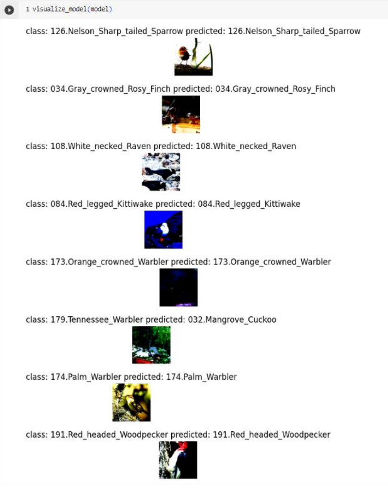

# Bird-Image-Classification
Deep Learning with PyTorch 

This project implements a **deep convolutional neural network (CNN)** for **image classification** on the **CIFAR-100 dataset** using **PyTorch**. The goal was to design and improve a baseline network (**BaseNet**) to achieve higher accuracy through **network architecture modifications, data augmentation, and hyperparameter tuning**.

## 🚀 Overview
- Developed a **deep convolutional neural network** for **100-category image classification**.
- Improved the baseline accuracy from **23%** to **68.4%** on the **Kaggle competition**.
- Fine-tuned **ResNet** for transfer learning, achieving **63.8% accuracy** on the test set.

## 🔧 Tools
- **Python**
- **PyTorch**
- **Google Colab** (for training with GPUs)
- **NumPy, SciPy, Matplotlib**
- **OpenCV** (for real-world image preprocessing)
- **Kaggle** (for model evaluation)

## 📊 Final Model Architecture
The final network consists of **three convolutional blocks**, each with:
- **Two convolutional layers** (`Conv2d`)
- **Batch normalization** (`BatchNorm2d`)
- **ReLU activations**
- **MaxPooling layers** (`MaxPool2d`)
- **two fully connected (FC) layers**


## 🔬 Key Experiments & Findings
### **1️⃣ Data Augmentation**
- Applied **RandomCrop(32, padding=4)** and **RandomHorizontalFlip()**.
- Improved accuracy from **39%** ➝ **59%**.

### **2️⃣ Increasing Model Depth**
- Tested **2, 3, and 4 convolutional blocks**.
- **3 blocks** provided the best performance (**59% accuracy**).

### **3️⃣ Optimizers & Learning Rate Tuning**
- **SGD (`lr=0.01, momentum=0.9`)** gave the best accuracy (**59%**).
- **Adam (`lr=0.001`)** had lower accuracy (**39%**).
- **Increasing `lr` to 0.05 caused overshooting**.

### **4️⃣ Weight Initialization**
- Adding weight initialization improved accuracy beyond **63%**, preventing stagnation.

---

## 🎯 Transfer Learning with ResNet
| Model Type               | Training Accuracy | Testing Accuracy |
|--------------------------|------------------|------------------|
| **Fine-tuning ResNet**   | **99.8%**        | **63.8%**        |
| **Fixed ResNet Features** | 88%              | 43%              |

- **Fine-tuning the entire network (ResNet)** significantly improved accuracy.
- **Training beyond 30 epochs led to overfitting**.

---

## 📸 Results


---

## 🔥 How to Run
1. Install dependencies:
   ```bash
   conda create --name pytorch_project python=3.8
   conda activate pytorch_project
   pip install torch torchvision numpy scipy matplotlib


## 📚 Acknowledgments
This project was developed as part of CMPT412 at SFU.
